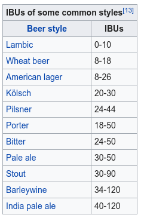

```{r setup, include=FALSE}
knitr::opts_chunk$set(echo = TRUE)

#knitr::opts_chunk$set(fig.width=12, fig.height=18) 

```

```{r echo=FALSE, message=FALSE, warning=FALSE, packages}
#fig1, fig.height = 10, fig.width = 20
knitr::opts_chunk$set(echo = TRUE)
library(readr)
library(ggplot2)
library(dplyr)
library(GGally)

recipeData <- read_csv("~/datasets/recipeData.csv")
styleData <-  read_csv("~/datasets/styleData.csv")
df <- merge(recipeData, styleData)
```

## Abstract

I explore homebrew beer recipes and the context of styles and ingredients. My goal is to explore patterns in the styles of beer to better understand how styles may be trending.

## Introduction

Kaggle.com has a wide variety of datasets for public consumption (mostly public, there are some private datasets). The beer data was downloaded from: <https://www.kaggle.com/jtrofe/beer-recipes/data>. The data consists of over 70,000 homebrew recipes from Brewer's Friend, a website for homebrewers. This data was initially in two separate .csv's. One .csv for recipe information (Name, Size, Original Gravity...), the other for beer-style (Lager, Ale, Stout, etc...). The two sets were merged on 'StyleID'.

### Univariate Plots Section

From the summary we can see the dataset contains 73,861 recipes with 23 variables. The below graph shows a distribution of beer recipes by color. The higher the number the darker the beer. We can infer from the distriubtion that there are significantly more light colored beers than dark beers. We'll unpack that below.

```{r  beer color, echo=FALSE}
qplot(x=Color, data = df,
      xlab = 'Beer Color',
      ylab = 'Number of beers in sample',
      binwidth = 1, color = I('black'), fill = I('#f79420'))
  
```

## Univariate Analysis

### 10 Most Common Beer Styles

Of 176 styles, the 10 most common styles of homwbrew recipe are:

```{r Style, echo=FALSE}
w = table(df$Style) 
t = as.data.frame(w) 
names(t)[1] = 'Style'

ggplot(subset(t, Freq>1150), aes(Style, Freq), xlim[which(t$Freq > 2500)],las=1) + geom_bar(stat= 'identity') + theme(axis.text.x = element_text(angle = 90))
```

Of the most 10 most popular recipes, we can see that American IPA's are by the most popular recipe and the most popular from the Brewer's Friend data.

### Beer and IBUs 
IBU, stands for International Bittering Units and measures a beer's bitterness. Bitterness is imparted by hops, during the brewing process. This table from <https://en.wikipedia.org/wiki/Beer_measurement> illustrates some of the most common beers and their IBU levels:

Out of 73,861 recipes we can see that the range for IBU is quite vast: 0 to 3409. Since 3409 seems quite high I'll be limiting the range of data for the boxplot to better see the distribution of IBUs:
```{r echo = FALSE, message=FALSE, warning=FALSE}
summary(df$IBU)
```

```{r echo =FALSE, message=FALSE, warning=FALSE}
boxplot(df$IBU, ylim =c(0,150),
      ylab = 'IBU')
```

#### Beer and ABV 
ABV is the measurement of Alcohol by Volume. ABV is measured in '%' and indicates the portion of beer that is alcohol. A higher ABV means a stronger beer. Of the 73,861 recipes we can see a pretty normal looking distribution. The plot below of ABV has been limited to shorten the right tail.

```{r summary bivariate, echo=FALSE, message=FALSE, warning=FALSE}
summary(df$ABV)
```

```{r echo = FALSE}
qplot(x=ABV, data = df,
      xlab = 'ABV of sample',
      ylab = 'Number of beers in sample',
      binwidth = 0.5, color = I('black'), fill = I('#f79420'))+
  scale_x_continuous(breaks = seq(1,20,1), limits = c(0,20))
```

## Univariate Analysis

#### Dataset structure
This dataset is comprised of a single table where each row is a unique observation or recipe and each column is represents corresponding features, such as color, bitterness and alcohol (ABV), with each recipe having unique characteristics.

#### Feature(s) of interest in the dataset
Due to the large number of feature variables and the large amount of observed data, there were a quite a few interesting features to explore. IBU, Style, ABV and Color all have potential to be explored further.

#### Other features in the dataset that will help support investigation of feature(s) of interest?
Moving forward, it will be interesting to explore the 'where' and 'how' the features intersect if they intersect at all. For example, Does ABV rise Color darkens?, or, the what is the role of IBU in terms of Style. Other features of possible importance could be Brew Method, Boil Size and Gravity. Exploring these variables may help to better understand the 'why' of a recipe's popularity.

#### New variables

Because of the number of the observations and the number of features it seems necessary to create some custom variables. While not needed for univariate analysis getting the means of features would be useful moving forward. It would also be a good idea to subset the data into a new dataframe to expedite the analysis, dropping some of the less correlated values. 

#### Investigating unusual distributions

While investigating the features it became quite apparent that home brewers are drawn to recipes of the American IPA style. While it is still unclear why, there is an extraordinary abundance of American IPA recipes compared to the other recipe styles.

## Bivariate Plots Section

### Beer Style Color by ABV

The below plots examine homebrew recipe styles as they relate to major features. Features include, ABV, IBU and Color.

The first plot examines all beer recipes in ascending order of color, light-dark on the X-axis and their alcohol content (ABV) on the Y-axis. 

```{r Bivariate_test,echo=FALSE,message=FALSE, warning=FALSE, fig.height = 10, fig.width = 20 }

dfCount <- count(df,Style) %>% arrange(Style)
dfABV <- group_by(df, Style) %>% summarize(ABV = mean(ABV))
dfColor <- group_by(df, Style) %>% summarize(color = mean(Color))
dfIBU <- group_by(df, Style) %>% summarize(IBU = mean(IBU))

dfMean <- merge(dfCount, dfABV)
dfMean <- merge(dfMean, dfColor)
dfMean <- merge(dfMean, dfIBU)

dfMean[29, "Style"] <- "Biere de Garde"
dfMean[94, "Style"] <- "Kolsch"
dfMean[102, "Style"] <- "Marzen"
dfMean[115, "Style"] <- "Oktoberfest Marzen"
    
ggplot(aes(x = reorder(Style, color), y = ABV), data = dfMean) + 
  geom_jitter(stat = "summary") +
  xlab("Styles by Color (light to dark)") +
  ylab("ABV") +
  theme(axis.text.x = element_text(angle = 66,hjust = 1, size = 3))
```

The above plot explores the relationship of homebrew recipe style (light to dark) and the mean ABV of the style.

### Style Popularity and ABV
```{r Bivariate_ABV,echo=FALSE,message=FALSE, warning=FALSE, fig.height = 10, fig.width = 20 }
ggplot(aes(x = reorder(Style, n), y = ABV ), data = dfMean) + 
  geom_jitter(stat = "summary") +
  xlab("Styles by Popularity") +
  ylab("ABV") +
theme(axis.text.x = element_text(angle = 66,hjust = 1, size = 3))
```

The above plot explores the relationship of homebrew recipe style (light to dark) and the mean alcohol content (ABV) of the style.

### Style Popularity and IBU
```{r Bivariate_IBU,echo=FALSE,message=FALSE, warning=FALSE, fig.height = 10, fig.width = 20 }
ggplot(aes(x = reorder(Style, n), y = IBU), data = dfMean) + 
  geom_jitter(stat = "summary") +
  xlab("Styles by Popularity") +
  ylab("IBU") +
  theme(axis.text.x = element_text(angle = 66,hjust = 1, size = 3))
```

The above plot, similar to the previous, explores the relationship of popularity of homebrew recipe style (least popular to most popular) and the mean bitterness (IBU) of the style. 

### Top 10 Styles and ABV
```{r Bivariate_Plots, echo=FALSE, message=FALSE, warning=FALSE}

ggplot(aes(x = Style, y = ABV), data = subset(dfMean, n >= 1152), 
       fill = Style) + 
  geom_bar(stat = "identity", color = I('black'), fill = I('#f79420')) +
  
  xlab("Top 10 Most Commmon Styles") +
  ylab("ABV") +
  theme(axis.text.x = element_text(angle = 45,hjust = 1))
```

In the above plot we can see how the 10 most common styles compare by ABV.

### Top 10 Highest ABV Styles (by style avg.)
```{r echo=FALSE, Bivariate_Plot2, message=FALSE, warning=FALSE}
       
ggplot(aes(x = reorder(Style, -ABV), y = ABV), data = subset(dfMean, ABV >= 9.99), 
       fill = Style) + 
  geom_bar(stat = "identity", color = I('black'), fill = I('violetred4')) +
  xlab("10 Highest ABV (on average) Styles") +
  ylab("ABV") +
  theme(axis.text.x = element_text(angle = 45,hjust = 1))
```

In the above plot we can see how the 10 highest ABV styles compare by ABV. Every style in the above plot has an ABV of 9.99 or higher. 20 proof beer recipes.

### Top 10 Highest IBU Styles (by style avg.)
```{r echo=FALSE, Bivariate_Plot3, message=FALSE, warning=FALSE}
       
ggplot(aes(x = reorder(Style, -IBU), y = IBU), data = subset(dfMean, IBU >= 68.749), 
       fill = Style) + 
  geom_bar(stat = "identity", color = I('black'), fill = I('#339933')) +
  xlab("10 Highest IBU (on average) Styles") +
  ylab("IBU") +
  theme(axis.text.x = element_text(angle = 45,hjust = 1))
```

In the above plot we can see how the 10 highest IBU styles compare by IBU.

### Top 10 Dakerst Colored Styles (by style avg.)
```{r echo=FALSE, Bivariate_Plot4, message=FALSE, warning=FALSE}
       
ggplot(aes(x = reorder(Style, -color), y = color), data = subset(dfMean, color >= 35.68), 
       fill = Style) + 
  geom_bar(stat = "identity",  color = I('black'), fill = I('wheat4')) +

  xlab("10 Darkest (on average) Styles") +
  ylab("Color") + 
  theme(axis.text.x = element_text(angle = 45,hjust = 1))
```

In the above plot we can see how the 10 Darkest styles compare by average color.

### PairPlots
```{r echo=FALSE, Pair_Plots, message=FALSE, warning=FALSE, fig.height = 10, fig.width = 20 }

library(GGally)

drops <- c("Name","URL", "StyleID","Style","BoilGravity","MashThickness","PrimaryTemp","PrimingMethod","PrimingAmount")

ggpairs(df[ , !(names(df) %in% drops)], 
        lower = list(continuous = wrap("points", shape = I('.'))),
        upper = list(combo = wrap("box", outlier.shape = I('.'))))

```

### Correlation  of Color : IBU
```{r corr,echo=FALSE, message=FALSE, warning=FALSE}
cor.test(dfMean$color, dfMean$IBU)
```

### Correlation  of Color : ABV
```{r corrABV,echo=FALSE, message=FALSE, warning=FALSE}
       
cor.test(dfMean$color, dfMean$ABV)
```

### Correlation of Popularity : IBU
```{r corrn,echo=FALSE, message=FALSE, warning=FALSE}
       
cor.test(dfMean$n, dfMean$IBU)
```

## Bivariate Analysis

The above plots used bivariate analysis to fruther explore the relationships between some of the values from earlier in the univariate plots.

The univariate plots helped to establish the idea of popularity of the American IPA recipe style. To expand on the popularity concept a new data frame was created that focused on a few specific style characteristics and explored those using mean values.

The first scatter plot shows styles on the X-axis in ascending order of color (light to dark), the styles are then plotted according to their ABV. It would appear that there is a slight correlation between color and ABV. While there are some significantly higher ABV lighter beers, generally it seems, beer styles get darker and their alcohol tends to increase. Interestingly, outlier styles are can be seen as high-ABV points on the left side of the scatter plot.

The second and third scatter plots show recipe style in ascending order of popularity (with American IPA at the far right as expected) by ABV and IBU successively. The first scatter plot does not show nearly as clear a correlation as the plot with IBU and popularity. 

The above bar plots were used to illustrate the criteria of the top 10 of each factor:
 Highest Recipe Count by ABV 
 Highest Avg. ABV by Style
 Highest Avg. IBU by Style
 Darkest Avg. Color by Style

### Highest Recipe Count, Highest ABV and Highest IBU 

Plotting these produced some interesting insights. Univariate analysis had already shown that American IPAs were popular. What univariate does not really describe though is "why?". By plotting the top 10 recipes and their ABVs we can see that American IPAs are not necessarily being brewed for their alcohol content, as the American IPA recipe is middle of the road on ABV. If high alcohol was the goal, brewers would be brewing Meads, Metheglins, Melomels and Barleywines. 

Instead we were able to gain some insight when we looked at the top 10 bitterest (IBU) styles. While not the most bitter, American IPA did show up in 9th place. Another interesting takeaway was the prevelance of the 'IPA' style in the top 10 IBU category, with IPAs taking 6 out of 10 spots. Understanding what an IPA is useful in understanding why it is so prevelant in the IBU top 10. According to <http://allaboutbeer.com/beer_style/india-pale-ale/> India Pale Ales were brewed to withstand the sea trip from England to India in the 1700s. By adding higher than usual amounts of hops, a preservative, the beers were less likely to spoil both en route and once the beer arrived in India's warmer climate.

### Interesting Relationships

There were some interesting trends in the scatter plots too, mainly that IBU may be related to popularity. 

### Strongest relationships

IBU : Color, appear to have the strongest relationship. As color gets darker so increases the IBU of the recipe. Although the relationship of recipe popularity (n), n : IBU - has an almost siginificant relationship (0,265), as recipes gain IBUs so do they gain in popularity.

## Multivariate Plots Section

### ABV : IBU : Color

```{r echo=FALSE, Multivariate_Plot1, message=FALSE, warning=FALSE, fig.height = 10, fig.width = 20 }
ggplot(aes(x = ABV, y = IBU), data = df) +
  geom_point(alpha = 1/2, size = 3/4, position = "jitter", aes(color = Color)) +
  scale_y_sqrt()
```

### Color : IBU Colored by Style of 25 Most Popular Recipes  

```{r echo=FALSE, Multivariate_Plot2, message=FALSE, warning=FALSE, fig.height = 10, fig.width = 20 }

ggplot(aes(x = color, y = IBU), data = subset(dfMean, n >= 675)) +
  geom_jitter(aes(color = Style), stat = "summary") +
  xlab("Color (light to dark)") +
  ylab("IBU")
```

### Color : ABV Colored by Style of 25 Most Popular Recipes 

```{r echo=FALSE, Multivariate_Plot3, message=FALSE, warning=FALSE, fig.height = 10, fig.width = 20 }

ggplot(aes(x = color, y = ABV), data = subset(dfMean, n >= 675)) +
  geom_jitter(aes(color = Style), stat = "summary") +
  xlab("Color (light to dark)") +
  ylab("ABV")
```


## Multivariate Analysis

During the multivariate observations, especially while reviewing the 'color : ABV' relationship of the top 25 recipes, it was easier to see which recipes were behaving oddly and why. The recipes with the 'Imperial' variety appear to upset the trend. According to <https://www.beeradvocate.com/community/threads/what-does-imperial-suggest.60937/> "Imperial" was originally used to denote a style of beer brewed in England for export to Russia. Like the India Pale Ale, a more robust recipe was used to keep the beer from spoiling. Now, imperial ales and stouts refer to higher hop content (IBU) or higher alcohol (ABV).

### Interesting findings

Knowing the information about the 'Imperial' naming factor explains why the 'Imperial IPA' style behaves like the other ales, but with more IBU and more ABV. It also helps to explain why the imperial stout style has such a higher than usual ABV than the other stout styles.

------

## Final Plots and Summary

### Plot One

```{r echo=FALSE, Plot1, message=FALSE, warning=FALSE, fig.height = 10, fig.width = 20 }

ggplot(aes(x = ABV, y = IBU), data = df) +
  geom_point(alpha = 1/2, size = 3/4, position = "jitter", aes(color = Color)) +
  scale_color_gradient(low = 'orange', high  = 'brown') + 
  scale_y_sqrt()+
  scale_x_sqrt()+
  xlim(0, quantile(df$ABV, 0.95)) + 
  ylim(0, quantile(df$IBU,0.95)) +
  geom_smooth(method = 'lm', color = 'red') +
  xlab("ABV") +
  ylab("IBU")

```

### Description One

 I chose the above plot for plot 1 because it represents an ideal place to conduct a more in depth analysis. Each point represents a recipe, plotting - ABV : IBU : Color. The plot begins to hint at a relationship, although it is not yet clear which values are related and how. It can bee seen that there are a number of recipes that tend to follow the linear mean line, in terms of darkening as IBU increase and ABV increases.  

### Plot Two

```{r Bivariate_IBU_final, echo=FALSE,message=FALSE, warning=FALSE, fig.height = 10, fig.width = 20 }
ggplot(aes(x = reorder(Style, n), y = IBU), data = dfMean) + 
  geom_jitter(stat = "summary") +
  xlab("Styles by Popularity") +
  ylab("IBU") +
  theme(axis.text.x = element_text(angle = 66?)) 
```

### Description Two

Plot two was chosen because it attempts to better explore the data from plot 1. In the above plot recipe-by-popularity is on the X-axis, and again, bitterness (IBU) is on the Y-axis. In particular this plot explores the nature of the previous plot's cluster by narrowing down the cluster into the distinct recipes and averaging some of the values. From over 70K observations down to 176, the trend of increasing IBU can now be seen as correlated to popularity.

### Plot Three

```{r echo=FALSE, Final_Plot3, message=FALSE, warning=FALSE, fig.height = 10, fig.width = 20 }

ggplot(aes(x = reorder(Style, n), y = IBU), data = subset(dfMean, n >= 675)) +
  geom_jitter(aes(color = Style), stat = "summary")+ 
  theme(axis.text.x = element_text(angle = 90)) +
  xlab("Styles by Popularity") +
  ylab("IBU")
```

### Description Three

Plot 3 digs deeper still into the correlation of IBU and popularity. This plot takes a snapshot of the top 24 recipes, left to right on the X-axis, IBU on the Y-axis. With the exception of a few outliers (Double IPA and Imperial IPA), we can see that the preference for bitter beers holds mostly true for the most popular recipes. 

------

## Reflection

This exploration was an insightful and enjoyable way to explore a topic of interest. Personally, as a beer enthusiast it really shed light on what was until now, a hunch. That is, that more and more hoppier (biiter) beers are appearing on menus and being sold in stores. Factually exploring and quantifying the idea of a beer style's popularity really addresses the power of analytics.

At first the correlation was difficult to express in terms of features. I had to try a number of different featuree types together and ulitmately create a new dataset. However, I feel I was able to correctly select the right features and group the right observations so that I could honestly say, "yes, there is a correlation here." 

Next steps could dig into the specific beer styles. For example, it would be interesting to discover what exactly about the American IPA style are homebrewers so fascinated by. Also, it would be interesting to make a predictive model that would be able to correctly identify a style based upon as few features as possible. 
